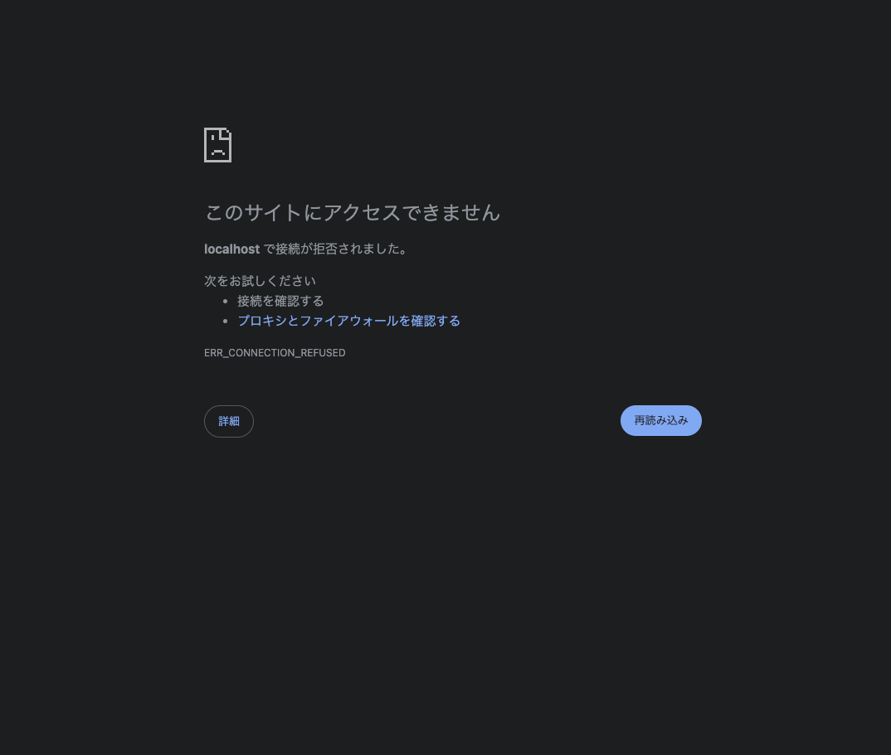

# サーバーとは

## 「サーバー」は2つの意味で使われる

| 意味                   | 説明                                     | 例                          |
| ---------------------- | ---------------------------------------- | --------------------------- |
| 機械としてのサーバー   | OSが動いているコンピュータそのもの       | VPSで借りた1台              |
| ソフトとしてのサーバー | リクエストを受け取って、返事を返すソフト | Nginx、Gunicorn、PostgreSQL |

「Webサーバー」「アプリケーションサーバー」「DBサーバー」は、ソフトとしてのサーバーの話。

## 役割による種類

Webアプリは、役割の違う3種類のサーバー（ソフト）を組み合わせて動かす。

| 種類                     | 役割                                                                                         | 例                                               |
| ------------------------ | -------------------------------------------------------------------------------------------- | ------------------------------------------------ |
| Webサーバー              | インターネットからのアクセスを最初に受け取る。静的ファイルは自分で返し、それ以外は後ろに渡す | Nginx、Apache                                    |
| アプリケーションサーバー | アプリのプログラムを動かして、結果を返す                                                     | Gunicorn（Python）、PHP-FPM（PHP）、Puma（Ruby） |
| DBサーバー               | データを保存し、問い合わせに答える                                                           | PostgreSQL、MySQL                                |

```text
ブラウザ -> Webサーバー -> アプリケーションサーバー -> DBサーバー
```

## なぜWebサーバーとアプリケーションサーバーを分けるのか

Webアプリへのリクエストは2種類ある。

| 種類                 | 例                                | 担当                     |
| -------------------- | --------------------------------- | ------------------------ |
| 軽いけれど数が多い   | CSS・JS・画像などのファイルを返す | Webサーバー              |
| 重いけれど数は少ない | アプリのプログラムを動かす        | アプリケーションサーバー |

1ページを表示するだけで、HTMLの1件に加えて、CSS・JS・画像の分だけリクエストが発生する。

|                        | アプリケーションサーバー       | Webサーバー              |
| ---------------------- | ------------------------------ | ------------------------ |
| 同時に処理できる数     | 数個                           | 数千以上                 |
| ファイルの返し方       | プログラムで読み込んでから送る | ディスクからそのまま流す |
| プログラムを動かせるか | 動かせる                       | 動かせない               |

全部をアプリケーションサーバーに回すと、数個しかない処理係が「ファイルを返すだけ」の軽い仕事で埋まり、プログラムを動かすという本来の仕事が待たされる。

「同時にたくさん処理できる」のは、軽い仕事しかしないから。「プログラムを動かせて、かつ数千を同時に処理できる」ソフトがあれば1つで済むが、仕事の重さが違うので両立しない。だから軽い仕事の係と重い仕事の係に分けている。

※ アプリケーションサーバー側で静的ファイルを**返せない**わけではない。**返させない方が効率がいい**から分けている。

## なぜ開発用サーバーではだめなのか

Webフレームワークには開発用のサーバーが付属している（`runserver` など）。開発中は、これが3つの仕事を1人で全部やっている。

1. ブラウザからのアクセスを受け取る
2. アプリのプログラムを動かす
3. CSSなどの静的ファイルを返す

ただし開発用サーバーは開発専用で、遅く、安全性も低い。本番ではこの仕事を分業させる。

```text
開発中: ブラウザ -> 開発用サーバー（1, 2, 3 を全部）

本番:   ブラウザ -> Webサーバー（1 と 3） -> アプリケーションサーバー（2）
```

### なぜ開発用サーバーは安全性が低いのか

開発用サーバーでは、次のような制限を設定できない。

- リクエストの制限時間
- 同時に接続できる数
- 受け取れるデータの大きさの上限
- 同じ相手からの接続数

専用の防衛機能がないという話ではなく、これらを設定できないことで、結果としてセキュリティ上のリスクがある。

## 「サーバーが落ちた」とは

| 状態                             | エンジニアの言い方                             | 対処                       |
| -------------------------------- | ---------------------------------------------- | -------------------------- |
| 動いているが、処理が追いつかない | 「重い」「詰まっている」「さばききれていない」 | アクセスが減れば自然に戻る |
| ソフトやOSが本当に停止した       | 「落ちた」「プロセスが死んだ」                 | 起動し直さないと戻らない   |

利用者から見えるのは「サイトが開かない」という結果だけで、原因は外からは分からない。だから利用者はどちらもまとめて「サーバーが落ちた」と呼ぶ。世間で言われる「サーバーが落ちた」は、ほとんどが前者。

技術的に正確な言い方ではないので、会話で「落ちた」と聞いた時は、どちらの意味なのかを確認した方が確実。

### 処理が追いつかない時の流れ

1. 大量にアクセスが来る
2. アプリケーションサーバーの処理係が全部塞がる
3. 後から来たリクエストが待ち行列に並ぶ
4. 処理が追いつかず、待ち行列が伸びて、順番が回ってくるまでの時間が長くなる
5. 制限時間を過ぎても返事をもらえなかったリクエストに対して、Webサーバーが504を返す
6. さらに増えて待ち行列が満杯になると、並ぶこともできずに502が返る

| 状況                                       | 返るエラー | 返るまでの時間 |
| ------------------------------------------ | ---------- | -------------- |
| 列に並べたが、制限時間内に順番が来なかった | 504        | 制限時間の後   |
| 列が満杯で、並ぶことすらできなかった       | 502        | すぐ           |

ワーカーは正常に動いて全力で処理しているが、来る量の方が多い状態。利用者から見ると、何度試してもエラー画面になるので「落ちた」と言われる。

### 本当に停止する主な原因

大量アクセスが原因の場合は「処理が追いつかない」状態になる方がずっと多い。本当に停止する原因の多くは、アクセス数とは別のところにある。

- **メモリ不足**: メモリが尽きると、OSは空きを作るために動いているソフトのどれかを強制終了する
- **ディスクの空きがなくなる**: ログファイルは放っておくと増え続ける。満杯になるとDBサーバーが書き込めなくなって停止する
- **デプロイの失敗**: 更新したコードにエラーがあってアプリケーションサーバーが起動できない、など
- **機械の再起動後に、ソフトが自動で立ち上がらない**: 自動起動の設定をしていないと停止したままになる
- **VPS事業者側の障害**: 自分では防げない

## サーバーが停止した場合

サーバーが停止したらエラーコードを返すこともなく、ただページが開けなくなる。

404・500・502・504などのステータスコードは、すべてサーバーが利用者に返す「返事」なので 当然返事をするサーバーが動いていなければ、番号も返せない。
404も「サーバーは動いているが、そのURLに対応するページが無い」という返事なので、サーバーが停止している時は同じく返らない。

### 停止した場所ごとの結果

```text
ブラウザ -> Webサーバー -> アプリケーションサーバー -> DBサーバー
```

| 停止したもの             | 利用者に返るもの          | 返しているソフト                   |
| ------------------------ | ------------------------- | ---------------------------------- |
| DBサーバー               | 500 Internal Server Error | アプリケーションサーバー（アプリ） |
| アプリケーションサーバー | 502 Bad Gateway           | Webサーバー                        |
| Webサーバー              | エラーコードなし          | （誰も返せない）                   |
| 機械（OS）全体           | エラーコードなし          | （誰も返せない）                   |


### エラーコードが返らない時に表示されるもの

ブラウザが自分で用意している「このサイトにアクセスできません」という画面が表示される。サーバーからの返事ではなく、ブラウザが「返事をもらえなかった」ことを報告している表示。Wi-Fiを切った状態でサイトを開こうとした時に出る画面と同じ種類のもの。

| 表示される文字列           | 状況                                                                |
| -------------------------- | ------------------------------------------------------------------- |
| `ERR_CONNECTION_REFUSED`   | 機械（OS）は動いているが、Webサーバーが停止していて、接続を断られた |
| `ERR_CONNECTION_TIMED_OUT` | 機械全体が停止していて、いくら待っても何の反応も無かった            |

#### ▼ ERR_CONNECTION_REFUSED スクショ


