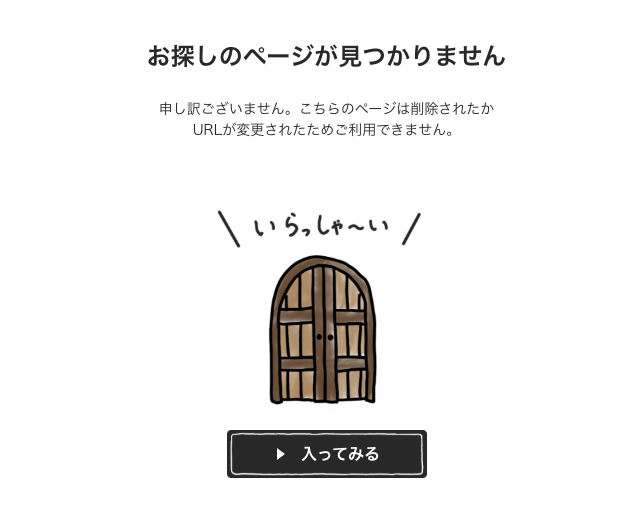
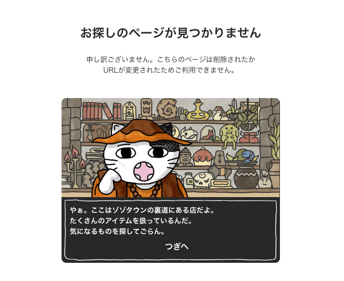

# ZOZOTOWN 404ページに学ぶ、優れたUX設計

## 概要

ZOZOTOWNの404(Not Found)ページは、エラー画面という負の接点をブランド体験に転換させた、UX設計のいい例だと思った。

[zozotown404 not foundのページ](https://zozo.jp/404.html)

  
  

---

## なにが優れているのか

### 1. ネガティブをポジティブに転換している

「ページが見つからない」という失望の瞬間を、扉と「いらっしゃ〜い」というメッセージで **「裏道のお店を発見するワクワク感」** に変換している。
エラーを「発見」に変える感情設計が秀逸。
むしろ「なんか始まった！」ってワクワクする。

### 2. 離脱を防いでいる

猫のキャラクターが「ゾゾタウンの裏道にある店」という設定で語りかけてくる、RPG風の会話形式を採用。
「つぎへ」のボタンで、ユーザーが能動的にサイト内を回遊したくなる導線になっている。

### 3. ブランドの世界観と一貫している

**ZOZOTOWN**のブランドコンセプトに、「裏道」「お店」という世界観がしっかり接続されている。
エラーページですらブランド体験の一部として設計されている。

### 4. ユーザーの次の行動が明確

「入ってみる」「つぎへ」という大きなボタンで、迷わず次のアクションを取れる。
離脱を防ぐ導線として機能している。

---

## UIではなくUXの話である理由

| 観点     | 内容                                                                             |
| -------- | -------------------------------------------------------------------------------- |
| UI(表層) | イラスト、ボタンの形、フォント、配色                                             |
| UX(体験) | エラーをブランド体験に転換させる発想、ストーリーで引き止める設計、感情の動かし方 |

仮に同じイラストを使っても、「申し訳ございません。トップへ戻る」だけのページであれば、UIは可愛くてもUXとしては平凡。
